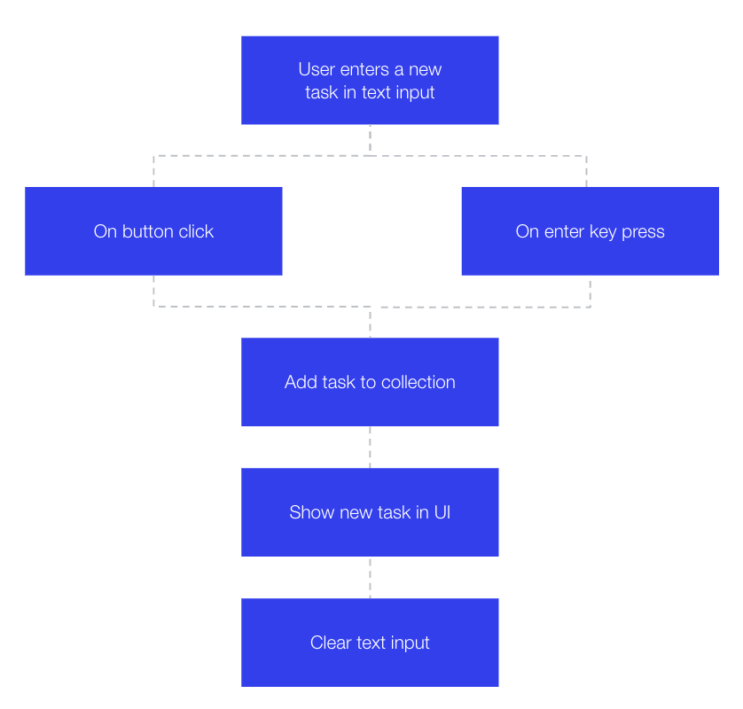

## Add functionality for adding a new task

The flow of adding a new task:

<p padding="40px"></p>

We will now start writing our home page front-end code in the Corvid integrated IDE.
You can also work on your own local IDE using [Corvid CLI](https://support.wix.com/en/article/working-with-the-corvid-cli).

**:bulb: New concepts**

- [$w](https://www.wix.com/corvid/reference/$w.html#$w) - Selects and returns elements from a page.
- [WixData](https://www.wix.com/corvid/reference/wix-data.html) - Functionality for working with data in collections.

**:white_check_mark: Step-by-step directions**

1. Add code for [button.onClick](https://www.wix.com/corvid/reference/$w.Button.html#onClick) event on the task button using \$w.

```
$w('#addTaskButton').onClick(() => {
	// event code here
})
```

2. Get the task [textInput.value](https://www.wix.com/corvid/reference/$w.TextInput.html#value).

```
$w('#addTaskButton').onClick(() => {
	const taskTitle = $w('#taskInput').value
})
```

3. Import wixData module in the top of the page.

```
import wixData from 'wix-data';
```

4. Insert the new task.

```
const newTask = {
	title: taskTitle,
	completed: false
}

await wixData.insert('TodoTasks', newTask)
```

5. Re-fetch the [dataset](https://www.wix.com/corvid/reference/wix-dataset.Dataset.html) data using the [dataset.refresh](https://www.wix.com/corvid/reference/wix-dataset.Dataset.html#refresh) function after inserting the new task.

```
await $w('#dataset1').refresh()
```

6. Clear the task [textInput.value](https://www.wix.com/corvid/reference/$w.TextInput.html#value).

```
$w('#taskInput').value = ''
```

7. Extract the logic to addNewTask function and add condition for checking emptyness.

```
const addNewTask = async () => {
	const taskTitle = $w('#taskInput').value

	if (taskTitle.trim() === '') {
		return
	}

	const newTask = {
		title: taskTitle,
		completed: false
	}

	await wixData.insert('TodoTasks', newTask)
	await $w('#dataset1').refresh()
	$w('#taskInput').value = ''
}
```

:warning: Don't forget to call it from your onClick event

8. Add [textInput.onKeyPress](https://www.wix.com/corvid/reference/$w.TextInput.html#onKeyPress) event on the task text input.

```
$w('#taskInput').onKeyPress(async event => {
	// event code here
})
```

9. Call addNewTask if the [key](https://www.wix.com/corvid/reference/$w.KeyboardEvent.html#key) in the [event](https://www.wix.com/corvid/reference/$w.KeyboardEvent.html) object is **Enter**.

```
$w('#taskInput').onKeyPress(async event => {
	const { key } = event
	if (key === 'Enter') {
		await addNewTask()
	}
})
```

:exclamation: **Go to preview, Add a new task, make sure it is being shown in the repeater.**

:fast_forward: Next Module => [Add functionality for changing the task status](CHANGE_TASK_STATUS.md)
