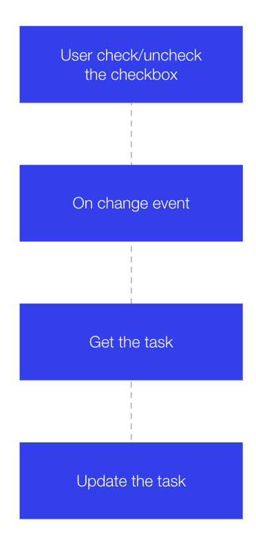

## Add functionality for changing the task status

The flow of changing the task completed status:

<p></p>

**:white_check_mark: Step-by-step directions**

1. First we'll create our `handleSwitchChange(event)` function. We'll do this so that whenever a user clicks on the switch it will switch its value between true and false. This value change will trigger the onChange event and then we can update our collection with `wixData` to record this.

```js
// Update the collection when a todo's completed status is changed
async function handleSwitchChange(event) {
    const $item = $w.at(event.context);
    const _id = event.context.itemId;
    const title = $item('#taskText').text;
    const checked = $item('#completedSwitch').checked;

    let updatedItem = {
        _id,
        title,
        completed: checked
    }

    await wixData.update(TODO_COLLECTION, updatedItem);
    // getIncompleteTodoCount(); // Commented out for now, we'll define this later!
}
```

So here we grab a few bits of information we need to update the object in our collection, notably its `_id`, `title`, and `completed` status. 

:information_source: The `Switch` element calls its property `checked` rather than `completed`.

:warning: When calling `wixData.update()` it's important to reconstruct the entire object and not just the part you want to update. Any fields that are not included in the `updatedItem` will be deleted if left empty, even if unchanged.

2. Now we'll hook it up to our event handler for the [Switch.onChange](https://www.wix.com/velo/reference/$w/switch/onchange) event.

```js
    // Event handler for when a todo's completed status is changed
    $w('#completedSwitch').onChange(handleSwitchChange);
```

:exclamation: **And that's it, you should now be able to toggle switches and in doing so change their `completed` status in your Data Collection. Go make a change in Preview mode and make sure it's being reflected in your Data Collection.**

:fast_forward: Next Module => [Uncompleted Tasks Counter](UNCOMPLETED_TASK_COUNTER.md)
