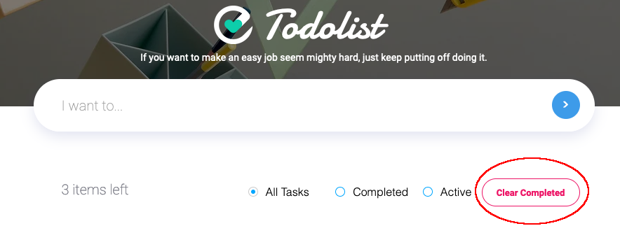
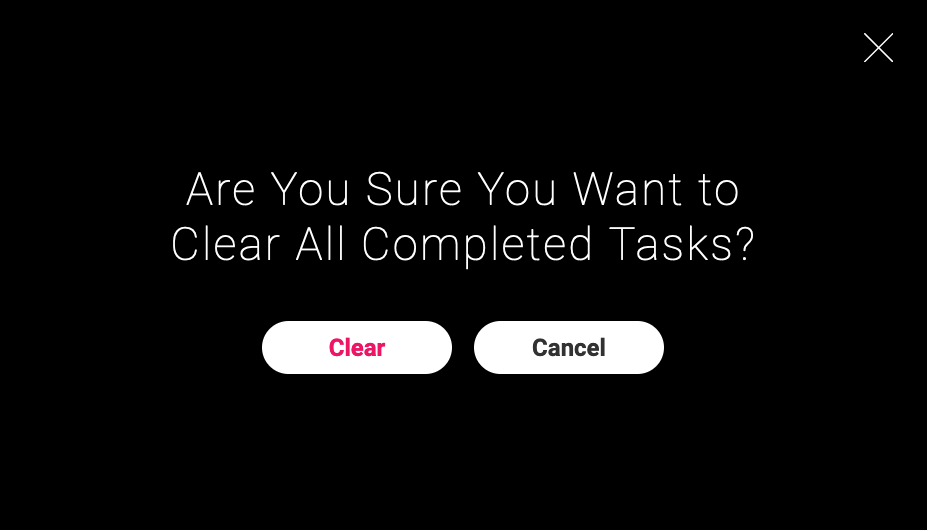
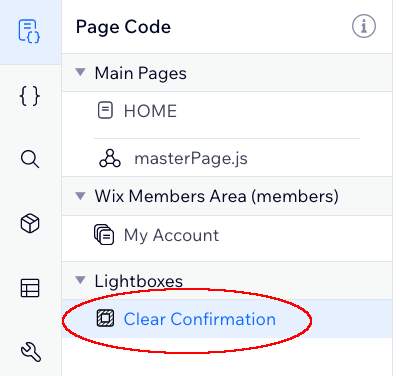

## Clear Completed Tasks

Now we'll introduce a **Clear Completed** button so users have an easy way to remove old todo items from their list.

HOME page:

<p></p>

Lightbox:

<p></p>

**:bulb: New concepts**

- [WixWindow](https://www.wix.com/velo/reference/wix-window.html) - Contains functionality that pertains to the current browser window.
- [Lightbox](https://support.wix.com/en/article/wix-editor-adding-and-setting-up-a-lightbox) - A way to show a modal/dialog on screen that overlays the current page.
- [WixWindow.lightbox](https://www.wix.com/velo/reference/wix-window.lightbox.html) - API for controlling a lightbox in frontend code.

**:white_check_mark: Step-by-step directions**

1. To use `wixWindow` we'll need another import at the top of our HOME code:

```js
import wixWindow from 'wix-window';
```

2. Now let's define a function to delete all of a user's tasks:

```js
// Delete all of a user's tasks where completed is set as true
async function clearCompletedTasks() {
    let completed = await wixData.query(TODO_COLLECTION)
        .eq('completed', true)
        .find()
    let toRemove = completed.items.map(i => i._id);
    await wixData.bulkRemove(TODO_COLLECTION, toRemove);

    $w(TODO_DATASET).refresh();
}
```
We'll do a `query()` like we have before, this time getting a set of items where `completed === true`. Then we'll call `wixData.bulkRemove()` to remove these items. Before calling `bulkRemove` though we'll need to first transform our data slightly, taking the set of `completed` items and turning them into the array of item ids that `bulkRemove` requires.


2. Now we could just hook this function right up to an `onClick` event handler and call it complete. However it would be pretty frustrating for a user if they accidentally clicked this button and lost tasks that they didn't intend to remove. So instead we'll setup our `'Clear Confirmation'` lightbox to confirm with the user before we proceed.

So let's start hooking up our lightbox. First we'll define our event handler. This gives us a kind of prototype that we can fill in the blank on in the next step.

```js
    // Event handler for when a user wants to clear completed tasks
    $w('#clearCompletedButton').onClick(async () => {
        let confirmed = await wixWindow.openLightbox('Clear Confirmation');

        if (confirmed) {
            clearCompletedTasks();
        }
    })
```

Pretty simple code, we'll call our lightbox, and when it closes we'll check if the user `confirmed` their choice to `clearCompletedTasks()` and if so we'll call this function to clear them. But now how do we know if the user `confirmed` their choice? To do that we'll setup the lightbox so it can communicate the user's choice back to our page code here.

3. Navigate to your "Clear Completed" lightbox. It shows up as a page in your list of pages on the left hand side of your screen. <p></p>

4. Now we'll have another page we can write code in just like we have been doing for HOME. So here we can set up our lightbox to send data back to the `wixWindow.openLightbox('Clear Confirmation')` command that called it earlier.

```js
import wixWindow from 'wix-window';

$w.onReady(function () {

    $w('#clearButton').onClick(() => {
        wixWindow.lightbox.close(true);
    });

    $w('#cancelButton').onClick(() => {
        wixWindow.lightbox.close(false);
    });

});
```

We've imported `wixWindow` so we can use its `wixWindow.lightbox.close()` function to respond to our calling function. Then we simply hookup event handlers for clicks on each of the buttons on this page. The `#clearButton` will close the lightbox and send back the response `true` while the `#cancelButton` will close it and send back `false`. So now we have completed our communication between our HOME's page code and the `'Clear Confirmation'` lightbox.

:information_source: You can send any data you want back in a `.close()` function. Here we've used a simple boolean but you can send back any kind of singular object.

:information_source: Communication between page code and lightboxes can be bidirectional. We just didn't need to send data to the lightbox in this case. Read about how your page code can [send context data to your lightbox](https://www.wix.com/velo/reference/wix-window/openlightbox) and how your lightbox can then [receive that context data](https://www.wix.com/velo/reference/wix-window/lightbox/getcontext).

:exclamation: **Go to preview, clear your completed tasks and make sure it works!**

:fast_forward: Next Module => [JavaScript Web Modules](JS_WEB_MODULES.md)
