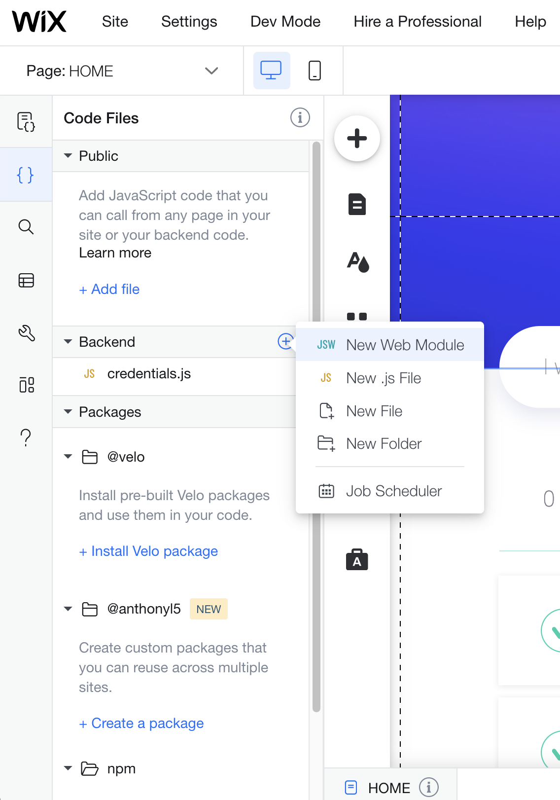

## JavaScript Web Modules

In this module, we will move the code for getting the active task count to the server and then call it from our front-end using JavaScript Web Methods.

**:bulb: New concepts**

- [JavaScript Web Modules](https://support.wix.com/en/article/velo-web-modules-calling-server-side-code-from-the-front-end) - Calling server-side code from the front-end.

**:white_check_mark: Step-by-step directions**

1. Add a new jws file called **taskOperations.jsw** by clicking **New Web Module** in the Site Structure panel.

   <p padding="40px"></p>

2. Remove the template code and export a new function called **getActiveTaskCount**.

```
import wixData from 'wix-data';

export async function getActiveTaskCount() {
	// function code here
}
```

3. Import wix-data and add the same logic we had in the front-end to the backend.

```
import wixData from 'wix-data';

export async function getActiveTaskCount() {
	const activeTaskCount = await wixData.query('TodoTasks')
		.eq('completed', false)
		.or(wixData.query('TodoTasks')
			.eq('completed', null))
		.count()

	return activeTaskCount
}
```

4. Go back to our HOME page and import the backend function we just created.

```
import { getActiveTaskCount } from 'backend/taskOperations'
```

5. Now we will replace the desired front-end code with our backend function. Please notice a backend function will always return a promise and therefore we must wait for the resolved value.

Replace this:

```
const activeTaskCount = await wixData.query('TodoTasks')
	.eq('completed', false)
	.or(wixData.query('TodoTasks')
		.eq('completed', null))
	.count()
```

With this:

```
const activeTaskCount = await getActiveTaskCount()
```

:muscle: Excercise: move the code that deletes the completed tasks to the backend as well. 

:exclamation: **We moved some logic to the backend. Go to preview to make sure all functionality still works.**

:fast_forward: Next Module => [NPM modules](PACKAGE_MANAGER.md)
