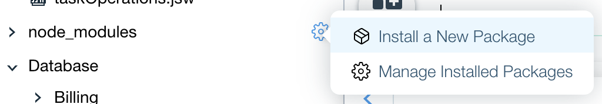
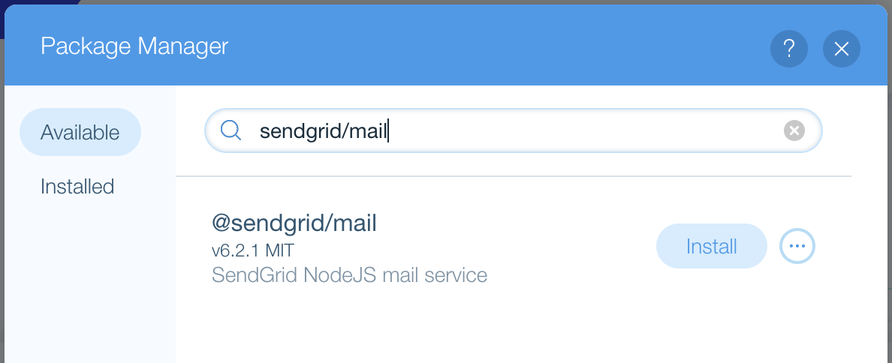
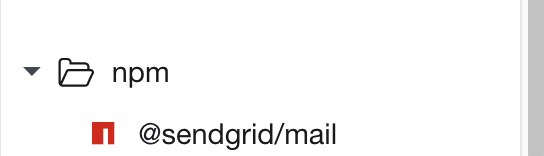

## Velo Package Manager

In this module, we will add a sendgrid module using the Velo package manager and use it to send emails.

:warning: Before we start, please create a free account in [sendgrid](https://sendgrid.com/) and then get a web API key for nodejs.

**:bulb: New concepts**

- [Package Manager](https://support.wix.com/en/article/velo-managing-external-code-libraries-with-the-package-manager) - Calling server-side code from the front-end.

**:white_check_mark: Step-by-step directions**

1. Install the **sendgrid/mail** node module from the Package Manager.

 <p padding="40px"></p>

 <p padding="40px"></p>

:warning: After the installation, you will see the new package under the node_modules section in the Site Structure panel.

 <p padding="40px"></p>

2. Create a new jsw file by the name **sendEmail.jsw**.

3. Remove template code and import the sendgrid module at the top of the file.
```
import sgMail from '@sendgrid/mail';
```

4. Add the key you got from sendgrid.
```
const KEY = '<sengrid_key>'
```

5. Create an async funcion called sendEmail and use sendgrid API to send an email.
```
async function sendEmail(to, subject, content) {
	sgMail.setApiKey(KEY)
	const message = {
		to,
		from: '<from_email>',
		subject,
		text: content
	}
	return sgMail.send(message)
}
```

:exclamation: **We currently have a function that will send an email on request. We will check if it works and how in the next module.**


:fast_forward: Next Module => [Scheduled jobs](SCHEDULED_JOBS.md)
