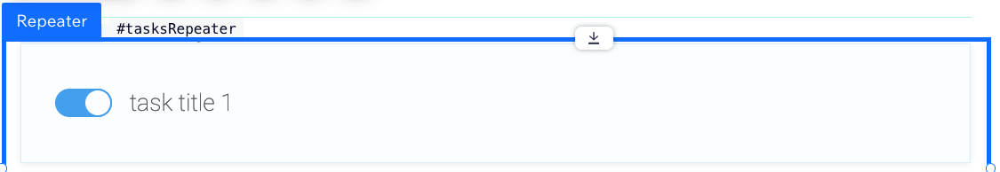
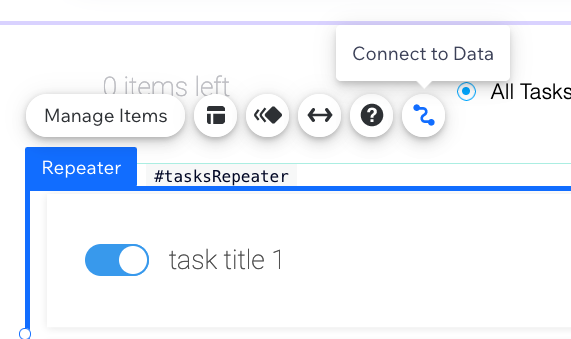
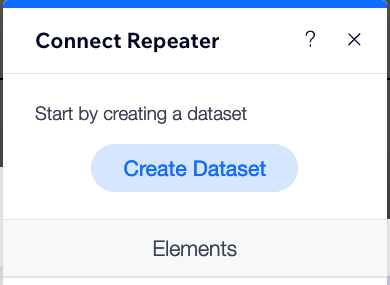
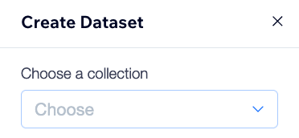
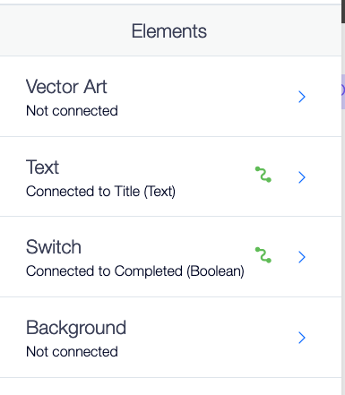
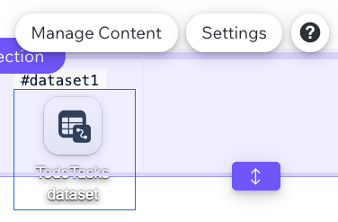

## Present the tasks on the page

On the HOME page, we have a repeater element. Each repeater item contains a checkbox and a text element.

We'll present the tasks from our collection in this repeater without writing any code. To do this, we'll connect it to our data using a **dataset**. 

**:white_check_mark: Step-by-step instructions**

1. First click the "Connect to Data" button on your repeater: 

1. Then choose "Create Dataset": 

1. Click the "Choose a collection" dropdown and select our "TodoTasks" collection we created earlier. Then click "Create". 

1. Now connect the elements. Connect the Text element to the "Title" column of the data collection, and connect the Switch element to the boolean "Completed" column of the data collection. 

1. Close that dialog box and notice now that there is a new element on your page called "TodoTasks dataset". Select it and click on "Settings". 

1. In settings set the "Mode" to "Read & Write". We'll do this because we want users to be able to both read their todo tasks and modify them from the repeater.  

1. Click the **Preview** button on the right side of the top bar menu to see your work in action! It should now be displaying the items from your repeater. But we'll still need to do a bit of work to get them to update your collection's data.

Hooray! Now let's continue to the next stage: adding a new task from the UI.

:fast_forward: Next Module => [Add functionality for adding a new task](ADD_NEW_TASK.md)
