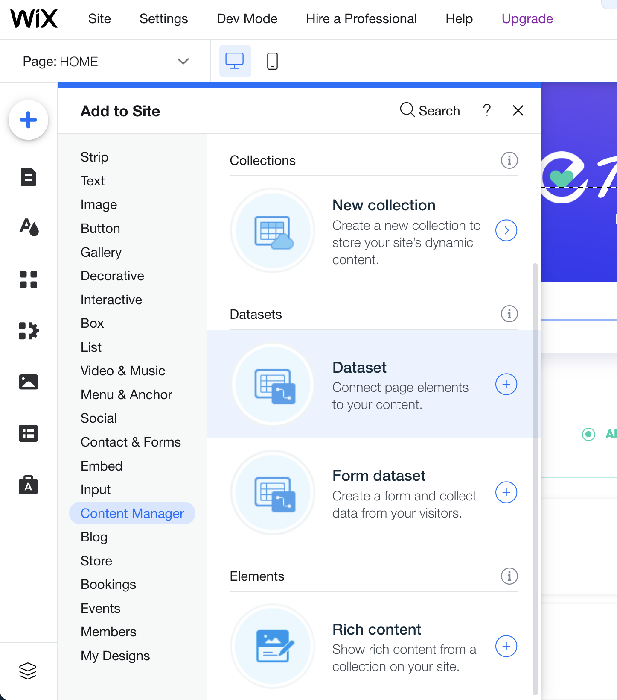
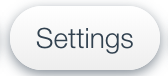
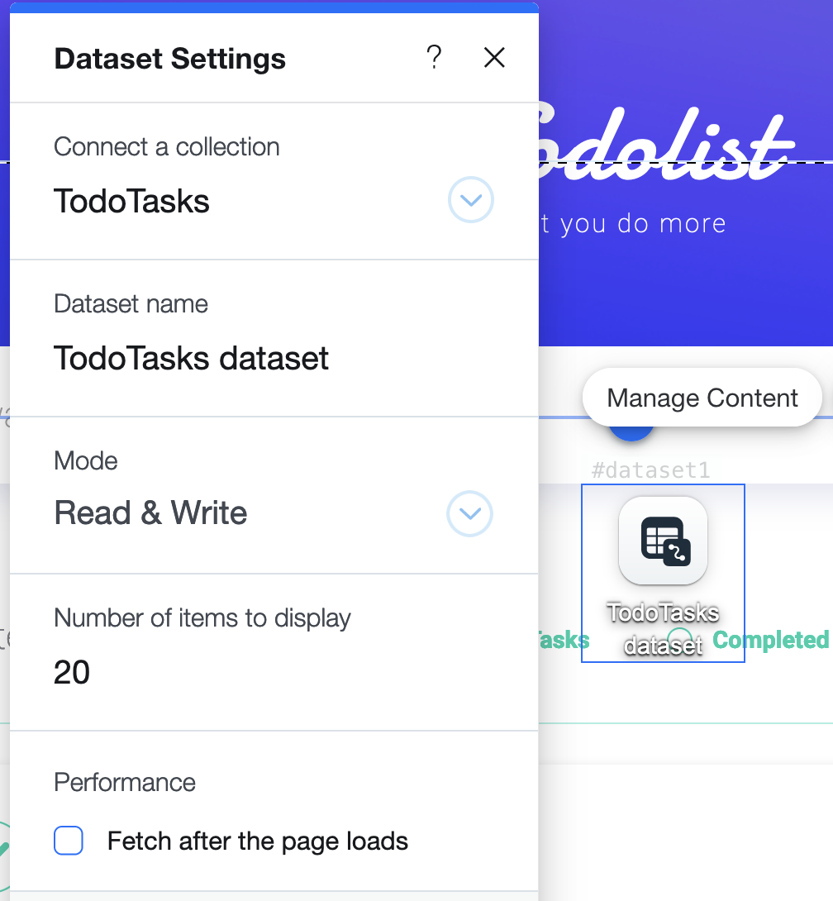
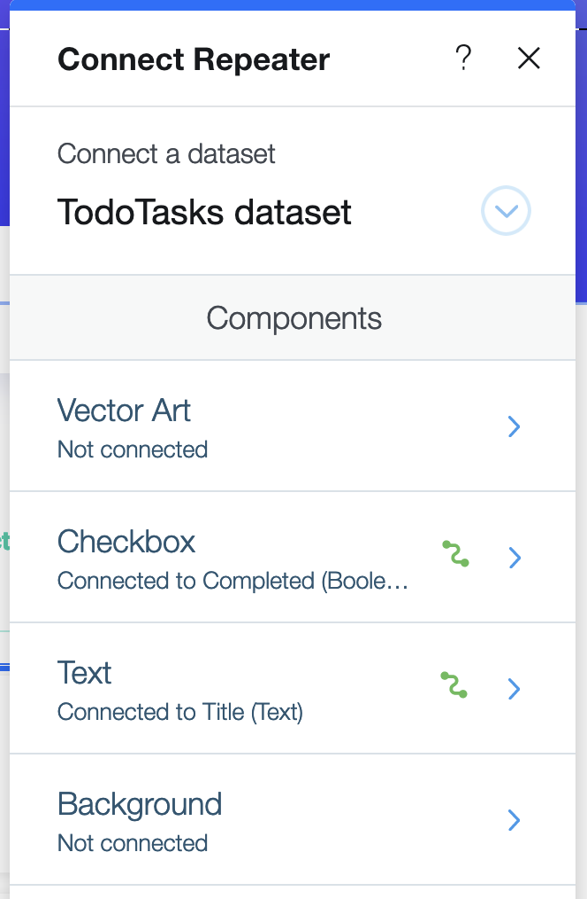

## Present the tasks on the page

On the HOME page, we have a repeater element. Each repeater item contains a checkbox and a text element.

We'll present the tasks from our collection in the repeater element without writing any code. To do this, we'll use a **dataset**. 

**:white_check_mark: Step-by-step instructions**

1. Add a [dataset](https://www.wix.com/corvid/reference/wix-dataset.html) by clicking the  from the vertical menu on the left side of the page. Then click **Database** >> **Dataset**. 

2. Click  to access the Dataset Settings.
3. Set the collection to **TodoTasks**.  Set the mode to **Read & Write**. 

4. Connect the repeater to the dataset by clicking the repeater's Connect button . Then connect the other elements. When they're connected, the Connect Repeater panel will look like this: 

:warning: To achieve these settings, you'll need to connect the text element and checkbox element from different Connect panels.  

5. Click the **Preview** button on the right side of the top bar menu to see the mock data from the collection.

Hooray! Now let's continue to the next stage: adding a new task from the UI.

:fast_forward: Next Module => [Add functionality for adding a new task](ADD_NEW_TASK.md)
