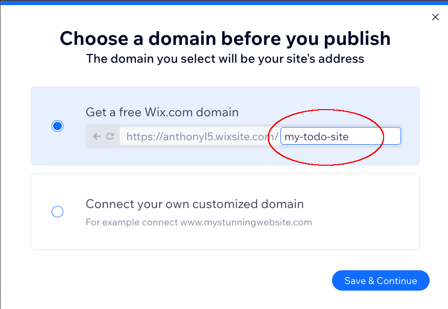
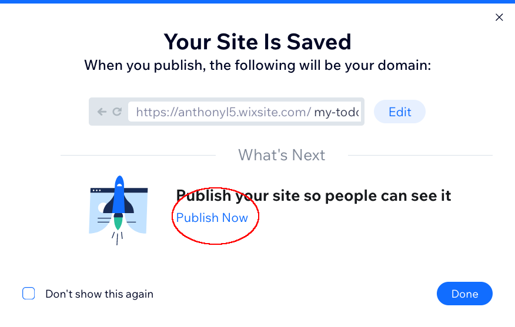
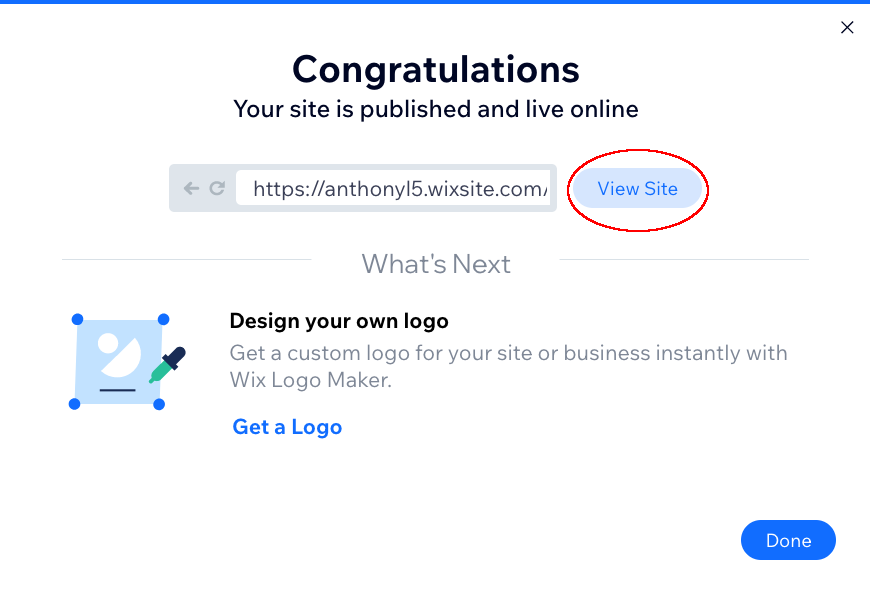

## Production

We finished building or application. Now, we want to publish our website. 

1. Go ahead and click the big "Publish" button on the top right part of your screen.

2. Give your site a URL and click "Save and Continue". 

3. Click "Publish now". 

4. And finally view your site and enjoy the culmination of all your work!  

:boom: **Hurray! You made it to the finish line! This is the perfect time to [join our Discord](https://discord.gg/devs-on-wix) and tell us what you'll build next!**

If you have the time check out some further reading below that cover maintaining your site, modifying it, and understanding how other parts of Wix and Velo work.

- [Publish your Site](https://support.wix.com/en/article/publishing-your-site-6980885) - Publish your site every time you make changes so that they appear on your live site.
- [Sandbox vs. Live](https://support.wix.com/en/article/accessing-your-sandbox-and-live-database-collections) - Each of your collections has two versions; one copy is your site's sandbox data, and the other is your site's live data. The sandbox data is what you work with while creating your site. The live data is what your visitors interact with once your site is published.
- [Monitor your application](https://support.wix.com/en/article/velo-about-site-monitoring) - Lets you gather information about Wix site events, such as console logs, HTTP functions, and web module functions.
