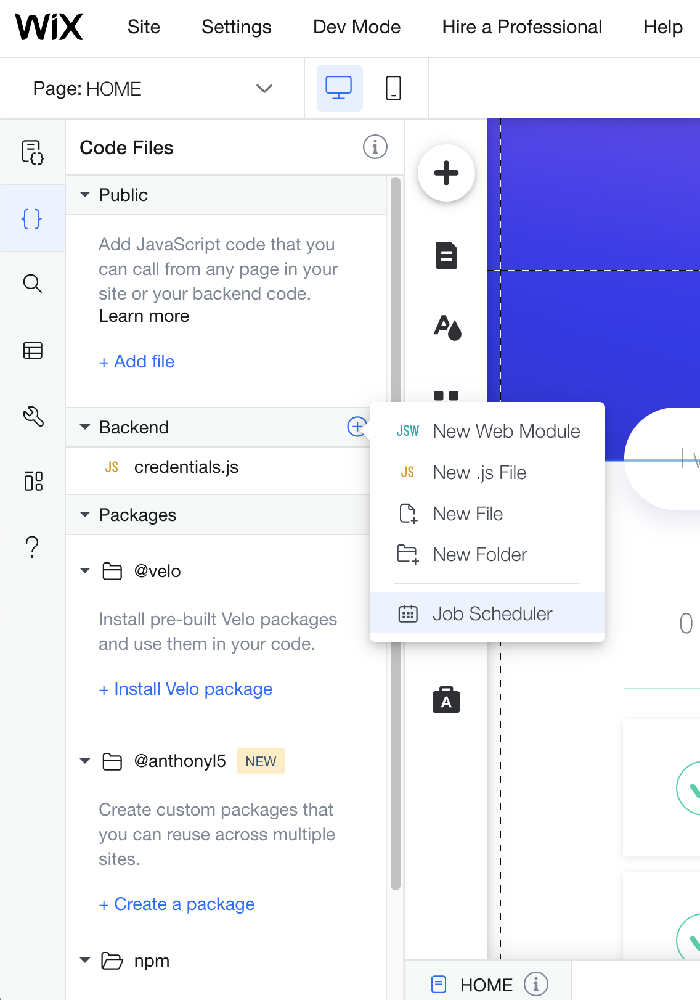

## Scheduled jobs

In this module, we will add a new job that will run daily and send an email to remind us how many active tasks we have left.

**:bulb: New concepts**

- [Job Scheduler](https://support.wix.com/en/article/velo-scheduling-recurring-jobs) - Allows you to schedule code to run at specified intervals.

**:white_check_mark: Step-by-step directions**

1. Export a new function in the **sendEmail.jsw** file.
```
export async function sendTaskReminder() {
	// function code here
}
```

2. Import **taskOperations.jsw** and get the active task count.
```
import { getActiveTaskCount } from 'backend/taskOperations'
...
export async function sendTaskReminder() {
	const activeTaskCount = await getActiveTaskCount()
}
```

3. Send the email with the amount of active tasks left.
```
export async function sendTaskReminder() {
	const activeTaskCount = await getActiveTaskCount()
    const content = activeTaskCount === 1 ? 'One task left' : `${activeTaskCount} items left`

    await sendEmail('<to_email>', 'Tasks Reminder!', content)
}
```

4. Add a **jobs.config** file from the Site Structure panel.
 
 <p padding="40px"></p>

 5. Set the config to call our **sendTaskReminder** function, daily at 15:00 pm UTC.
 ```
 // /backend/jobs.config
{
  "jobs": [
    {
      "functionLocation": "/sendEmail.sendTaskReminder",
      "description": "Send a daily reminder of the amount of active tasks",
      "executionConfig": {
        "time": "15:00"
      }
    }
  ]
}
 ```

:exclamation: **You created a scheduled job! Set the time in the job scheduler to a minute from now (UTC time). Make sure you get the email**

:warning: You can debug your application backend code using Velo [site monitoring](https://support.wix.com/en/article/velo-about-site-monitoring)

:fast_forward: Next Module => [Going to production](PRODUCTION.md)
