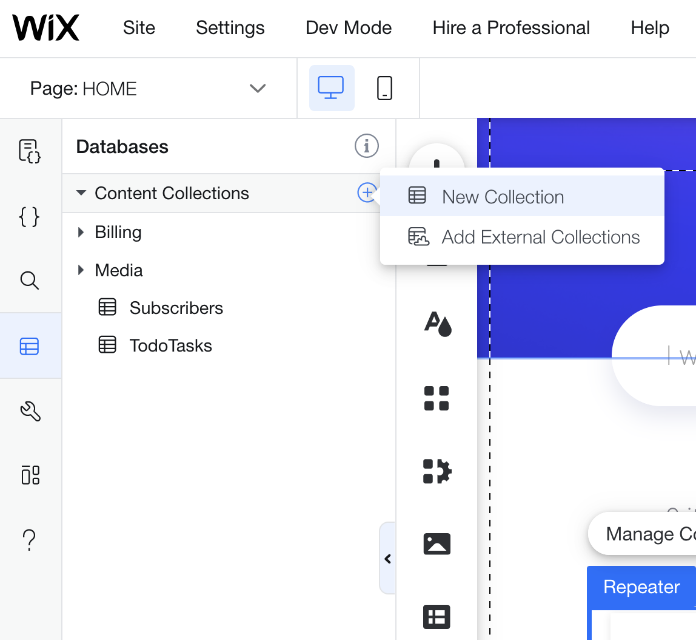
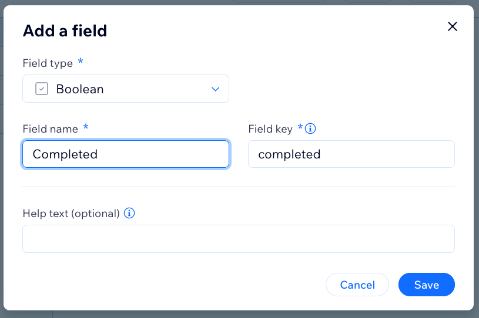
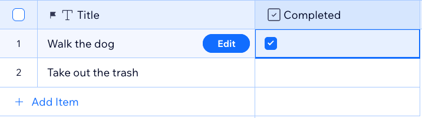

## Create a database collection for tasks

In this module, we'll create a database collection to store the application tasks.

 **:white_check_mark: Step-by-step instructions**

1. From the top bar menu, hover over **Dev Mode** and click **Turn on Dev Mode** to enable Velo. 

  
2. From the **Site Structure** sidebar on the left, under the **Database** section, click on the **Add a new collection** link. 

3. Click **Start Creating**. In the next panel that opens, click the button on the right, **Create a Collection**.
4. Name the collection **TodoTasks**. Click the **Create Collection** button.
5. A **Title** field will be created by default.  Add another field by clicking . Name the field **Completed** and set the Field Type to **Boolean**. Click **Add**. 

6. Add two items to your new collection and set one Completed status to true. 

:exclamation: **We just created a new database collection. In the next module, we'll present its data in our web application.**

:fast_forward: Next Module => [Present the tasks on the page](PRESENTING_THE_TASKS.md)
