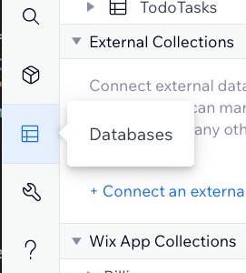
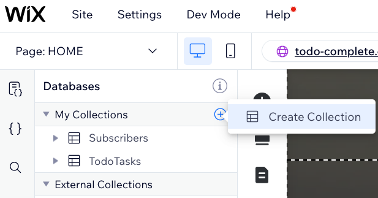

## Create a database collection for tasks

In this module, we'll create a database collection to store the application tasks.

 **:white_check_mark: Step-by-step instructions**

1. From the top bar menu, hover over **Dev Mode** and click **Enable Developer Mode**. 

1. From the **Site Structure** sidebar on the left, navigate to the **Databases** section. 

1. click on the **Create Collection** button. 

1. Name the collection **TodoTasks** and click **Create**.

1. A **Title** field will be created by default. Add another field by clicking the plus sign next to "Title". Name the field **Completed** and set the Field Type to **Boolean**. Click **Add**. 

1. Add two items to your new collection and set one Completed status to true. 

:exclamation: **We just created a new database collection. In the next module, we'll present its data in our web application.**

:fast_forward: Next Module => [Present the tasks on the page](PRESENTING_THE_TASKS.md)
