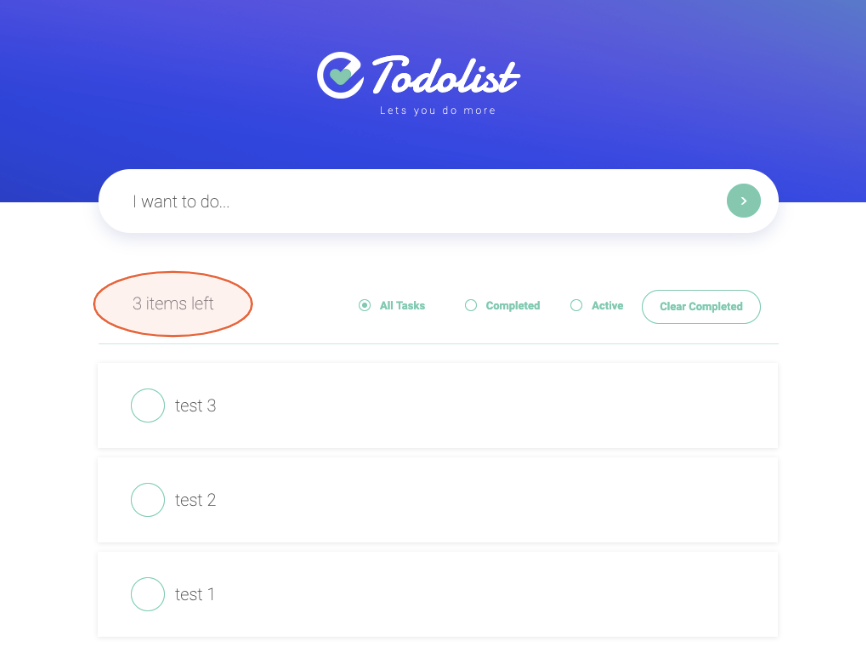

## Uncompleted Tasks Counter

In this module, we will present the remaining uncompleted tasks counter in the text element above our tasks repeater.

<p></p>

**:bulb: New concepts**
- Use [WixDataQuery](https://www.wix.com/velo/reference/wix-data.WixDataQuery.html) to retrieve data from your data collection.

**:white_check_mark: Step-by-step directions**

1. So first let's define our `getIncompleteTodoCount()` function. You might recall seeing this function mentioned in an earlier step. Now we'll get to define it so that it can update our "x items left" count. Nothing is more satisfying than seeing your TODO list count tick down so let's make that easy for our users to see!

```js
// Get the count of TODOs that are not marked completed
function getIncompleteTodoCount() {
    wixData
        .query(TODO_COLLECTION)
        .eq('completed', false)
        .count({ consistentRead: true }) // Count from primary database
        .then((result) => {
            $w('#activeTasksCount').text = `${result} items left`;
            $w('#activeTasksCount').show("float");
        })
        .catch(() => {
            $w('#activeTasksCount').hide();
        })
}
```

Here we use `wixData.query()` and it returns a [WixDataQuery](https://www.wix.com/velo/reference/wix-data.WixData.html) object that we can then call various functions on to construct our query. 

In this case we want all of our incomplete items, so we query for `.eq('completed', false)`. We don't want the items themselves, we just want to count them so we call `count()`.

`wixData` then returns a Promise and so we take the result of the Promise and update our task count. We also use `.show("float")` to make a neat little visual animation that calls the user's attention to the update.

:warning: We call `count()` with `{ consistentRead: true }` to avoid data inconsistencies. You can read more about [consistentRead and eventual consistency here](https://www.wix.com/velo/reference/wix-data/introduction#wix-data_introduction_wix-data-and-eventual-consistency) to understand why we do this.

2. Great now that we've got our function written we can call it where we need it. We'll need it in a few places: 
	1. In our `$w.onReady()` so it updates when the page loads.
	1. In our `authentication.onLogin()` event inside `$w.onReady()` as well because when users login it doesn't trigger a page refresh.
	1. In our `handleSwitchChange()` function so we can update the count whenever a user changes a task's completed status.

3. The first two places we're putting this are very similar and no matter what changes we make to the site we'll want our `$w.onReady()` and `authentication.onLogin()` to do the same initialization. So we'll follow a common pattern and create an `init()` function.

```js
// Initialize the page with data that we need
// but don't get through the dataset
async function init() {
    getIncompleteTodoCount();

	// We'll do this other thing later!
    // if (wixWindow.rendering.env === 'browser') {
    //     $w('#tagline').text = await getQuote();
    //     $w('#tagline').show("float");
    // }
}
```
:information_source: Right now our `init()` function is small, almost unnecessary, but it'll be more useful for avoiding duplicated code later.

4. Now we'll modify the code at the end of our `$w.onReady()` so our first 2 places (login and page refresh) are covered. Simple!

```js
import { authentication } from 'wix-members'; // import me!

$w.onReady(function () {
	// Rest of your code here...

    // Setup the page/init on both page render and login
    // Login doesn't trigger a new page render
    authentication.onLogin(init)
    init();
});
```


4. Lastly we also want to update `handleSwitchChange()` so our count is updated whenever a task's status is changed
```js
// Update the collection when a todo's completed status is changed
async function handleSwitchChange(event) {
	// Rest of your code here...
    getIncompleteTodoCount(); // you can uncomment me now!
}
```

:exclamation: **Go to preview, play with the completed status of the tasks and make sure the counter is updating. Spend a minute enjoying all you've accomplished so far!**

:fast_forward: Next Module => [Tasks Filter](TASK_FILTER.md)
